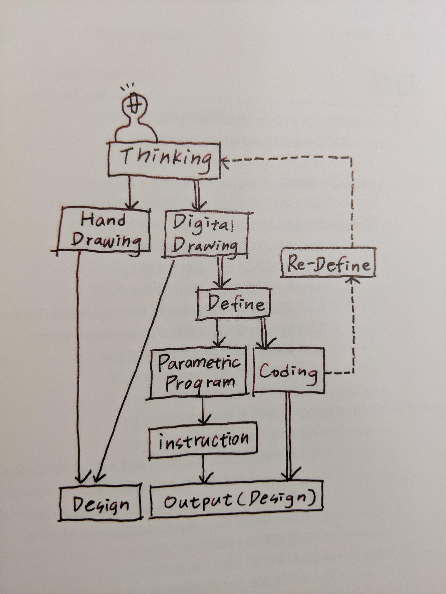

# GIS WORKSHOP
ERIK

---
<!-- page_number: true -->
Agenda
* introduction of me & gis
* gis stuffs
* assignment 1
* assignment 2
* Q&A
* quatsh

---
<!-- page_number: true -->
Intro

Urban Planning(major) & Architecture(minor) in NCKU 
Urban Planner in Engineering Consultants Ltd.
Data Engineer in Startup
Web GIS Developer in another Startup

---
<!-- page_number: true -->
GH PYTHON 幾何運算設計

credit: [幾何運算設計 GH PYTHON, 胡介璿 / 李宸安](https://www.pcstore.com.tw/surface3d/M60472626.htm)

---
<!-- page_number: true -->
what is gis?

kind of like data science

it's about the intersection among Statistics, Business, Computer Science

---
<!-- page_number: true -->
GIS cound be stack by 3 layers:
highest : story
higher : application ( data processing, analyse, visualization )
foundation : Math, Geometry, Geography

---
<!-- page_number: true -->
Start to do something geographic and magic
[QGIS](https://qgis.org/de/site/)

---
<!-- page_number: true -->
Hello Wold!
[QGIS Tutorials and Tips](http://www.qgistutorials.com/en/index.html)
[QGIS 3 Plugin Tutorial](https://gis-ops.com/qgis-3-plugin-tutorial-plugin-development-explained-part-1/)
[GIS Workshop](https://hackmd.io/EAoFhDmxQAeU8Qu6FspTjA)
[GIS Workshop - WMS](https://hackmd.io/q_RGOAyIRsKVrLJqfN7CdQ)
[QGIS及Open Geodata資源網@Sinica » Open data](http://gis.rchss.sinica.edu.tw/qgis/?cat=16)

---
<!-- page_number: true -->
# Further More

---
<!-- page_number: true -->

Blender
[BlenderGIS](https://github.com/domlysz/BlenderGIS)

---
<!-- page_number: true -->
Rhino + Grasshopper
[ELK](https://www.food4rhino.com/app/elk)

---
<!-- page_number: true -->
[KeplgerGL](https://kepler.gl)

---

<!-- page_number: true -->
Quatsch Zeit!

a story,

part of architecture,
part of non-architecture.

---
<!-- page_number: true -->
" Everyone has a original position;
I create Architecture with my original postion. "

by Architect Mao

---
<!-- page_number: true -->
" Your original position will always be moved by your ongoing life. "
\- my social service story

---
<!-- page_number: true -->
Bis bald!

Ein Leben ist zu kurz, ein Augenblick ist zu lang.